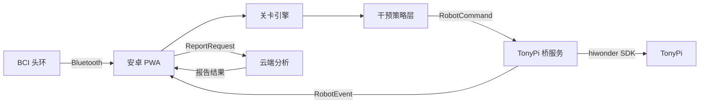

# 目标架构

## 推荐方案

采用“家长端 PWA + TonyPi 儿童互动执行端 + BCI 数据层 + 云端报告”的分层架构。

## 模块边界

- PWA：家长端界面、蓝牙连接、训练启动、会话记录、离线缓存、报告展示。
- 关卡引擎：读取 `LevelManifest`，推进状态机，产出 `SessionEvent` 和 `RobotCommand`。
- 干预策略层：把 BCI 指标转换为难度、提示、节奏或机器人反馈。
- TonyPi 桥服务：运行在 TonyPi 上，负责动作组、语音、摄像头/识别能力封装；TonyPi 是儿童训练体验的主要交互对象。
- 云端分析：接收训练数据，生成报告，不参与实时控制闭环。

## 关键风险

- Web Bluetooth 在不同安卓浏览器上的支持差异。
- PWA 与 TonyPi 在 AP/LAN 模式下的网络发现与连接稳定性。
- 旧 demo 中文资源存在编码问题，迁移前需统一 UTF-8。
- BCI 数据不应直接决定高风险机器人动作，必须有安全策略和降级方案。
